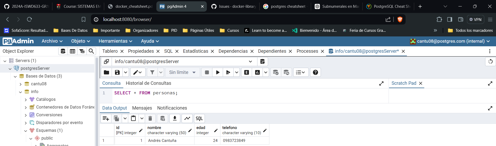

### Crear contenedor de Postgres sin que exponga los puertos. Usar la imagen: postgres:11.21-alpine3.17
```
docker run -d --name postgresServer -e POSTGRES_USER=cantu08 -e POSTGRES_PASSWORD=P@ssw0rd postgres:11.21-alpine3.17
```


### Crear un cliente de postgres. Usar la imagen: dpage/pgadmin4

```
docker run -d --name pgAdminClient -e PGADMIN_DEFAULT_EMAIL=cantu08@postgres.com -e PGADMIN_DEFAULT_PASSWORD=P@ssw0rd -p 8080:80 dpage/pgadmin4
```


La figura presenta el esquema creado en donde los puertos son:
- a: Puerto de host en pgAdmin4. (80)
- b: Puerto de contenedor en pgAdmin4. (80)
- c: Los puertos en Postgres **NO** se exponen. (No Asignado)


## Desde el cliente
### Acceder desde el cliente al servidor postgres creado.


### Crear la base de datos info, y dentro de esa base la tabla personas, con id (serial) y nombre (varchar), agregar un par de registros en la tabla, obligatorio incluir su nombre.

## Desde el servidor postgresl
### Acceder al servidor
### Conectarse a la base de datos info

### Realizar un select *from personas
