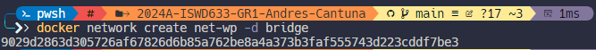
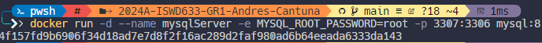
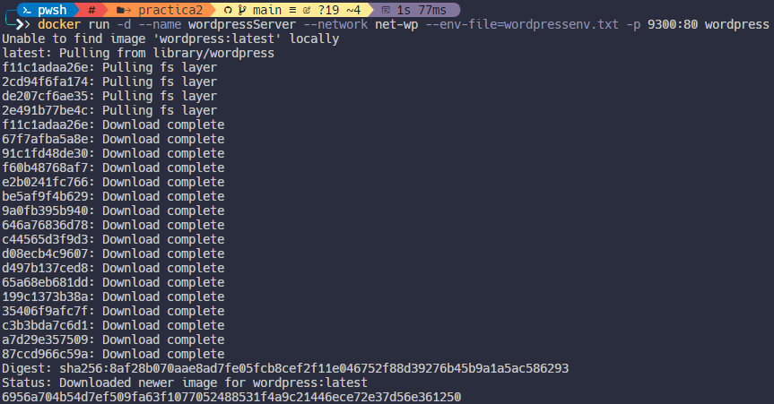
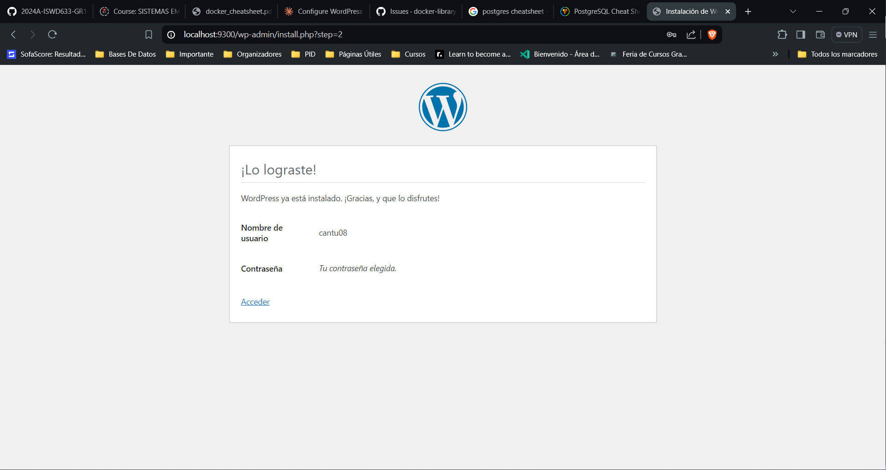
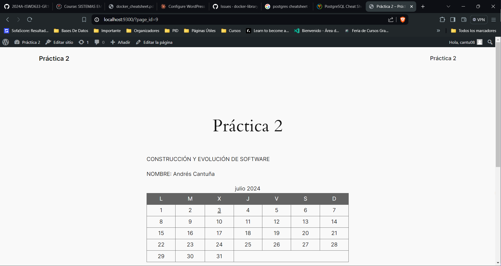
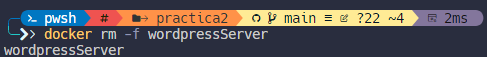
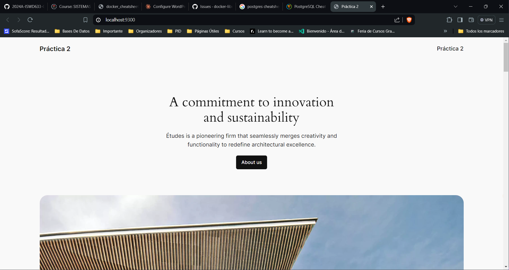

## Esquema para el ejercicio


### Crear la red
```
docker network create net-wp -d bridge
```


### Crear el contenedor mysql a partir de la imagen mysql:8, configurar las variables de entorno necesarias
 ```
 docker run -d --name mysqlServer -e MYSQL_ROOT_PASSWORD=root -p 3307:3306 mysql:8
 ```


### Crear el contenedor wordpress a partir de la imagen: wordpress, configurar las variables de entorno necesarias
```
docker run -d --name wordpressServer --network net-wp --env-file=wordpressenv.txt -p 9300:80 wordpress
```


De acuerdo con el trabajo realizado, en la el esquema de ejercicio el puerto a es **(9300)**

Ingresar desde el navegador al wordpress y finalizar la configuración de instalación.


Desde el panel de admin: cambiar el tema y crear una nueva publicación.
Ingresar a: http://localhost:9300/ 
recordar que a es el puerto que usó para el mapeo con wordpress


### Eliminar el contenedor wordpress
```
docker rm -f wordpressServer
```

### Crear nuevamente el contenedor wordpress
Ingresar a: http://localhost:9300/ 
recordar que a es el puerto que usó para el mapeo con wordpress

### ¿Qué ha sucedido, qué puede observar?

Automáticamente ingresa sin loggearse previamente.