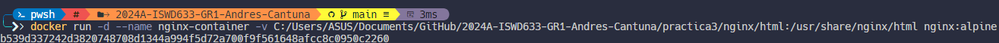

# VOLUMEN TIPO HOST
Un volumen host (o bind mount) es un tipo de volumen donde se monta un directorio o archivo específico del sistema de archivos del host en un contenedor.

```
docker run -d --name <nombre contenedor> -v <ruta carpeta host>:<ruta carpeta contenedor> <imagen> 
```

### Crear un volumen tipo host con la imagen nginx:alpine, para la ruta carpeta host: directorio en donde se encuentra la carpeta html en tu computador y para la ruta carpeta contenedor: /usr/share/nginx/html esta ruta se obtiene al revisar la se obtiene desde la documentación

```
docker run -d --name nginx-container -v C:/Users/ASUS/Documents/GitHub/2024A-ISWD633-GR1-Andres-Cantuna/practica3/nginx/html:/usr/share/nginx/html nginx:alpine
```


### ¿Qué sucede al ingresar al servidor de nginx?
Aparecerá el contenido del directorio host, en caso de no tener ningún fichero, aparecerá el **Error 403**.

### ¿Qué pasa con el archivo index.html del contenedor?
Será reemplazado por el archivo index que se encuentra en el host.

### Ir a https://html5up.net/ y descargar un template gratuito, descomprirlo dentro de nginx/html
### ¿Qué sucede al ingresar al servidor de nginx?
Aparecerá el contenido agregado en la ruta de host, en este caso, el template descargado.

### Eliminar el contenedor
```
docker rm -f nginx-container
```

### ¿Qué sucede al crear nuevamente el mismo contenedor con volumen de tipo host a los directorios definidos anteriormente?
Aparecerá nuevamente el contenido que se encuentra en la ruta del host.

### ¿Qué hace el comando pwd?
El comando **pwd** indica el directorio donde se encuentra trabajando actualmente.

Si quieres incluir el comando pwd dentro de un comando de Docker, lo puedes hacer de diferentes maneras dependiendo del shell que estés utilizando.


### Volumen tipo host usando PWD y PowerShell
```
docker run -d --name <nombre contenedor> --publish published=<valorPuertoHost>,target=<valor> -v ${PWD}/<ruta relativa>:<ruta absoluta> <nombre imagen>:<tag> 
```

### Volumen tipo host usando PWD (Git Bash)

```
docker run -d --name <nombre contenedor> --publish published=<valorPuertoHost>,target=<valor> -v $(pwd -W)/html:/usr/share/nginx/html <nombre imagen>:<tag> 
```

### Volumen tipo host usando PWD (en Linux)

```
docker run -d --name <nombre contenedor> --publish published=<valorPuertoHost>,target=<valor> -v $(pwd)/html:/usr/share/nginx/html <nombre imagen>:<tag> 
```

